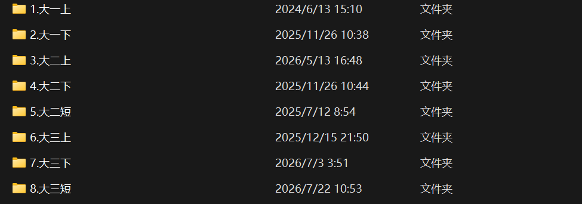

# 前言/碎碎念

短学期（~~生产食席~~）的时候，玩太嗨了，拖了很久，终于动笔（键盘）写下一个框架，但这标志着「本站」会有一个史诗级的建设（~~相当于建了个文件夹~~。

前面说了，我想留下点什么，于是开始写了「本站」内容。至于出发点是什么呢，不妨看看下面这张图，我从入学到现在，一直都会整理好自己的课程资料，但我从未写下像样的课程总结，也没有具体的回忆卷。庆幸的是，我发现我的舍友一直都在做23级的回忆卷，这样就足够了吧。虽然我的资料只有小范围的分享，也不知有帮助与否，但我觉得能贡献一点就贡献一点吧，现在也把所有能分享的分享给大家，还是希望对后人有所帮助。

再次强调，「本站」大部分课程我都是通过考前补天突袭完成的，经验方面具有一定局限性。个体能力差异，不能保证我的方法对你也能达到同样的奇效，请不要把「本站」当做【通关秘籍】使用。另外，「本站」涉及的课程时间范围较大，部分课程和教材有所更改，可能缺乏一定时效性，课程具体内容、平时分构成、**考试试卷题型（重点）**，还请自行了解求证其真实性。不然可能像我一样，听了一些不当信息，在考场上「拔剑四顾心茫然」。

谨以此站，致敬我「悲壮」的本科三/四年学习生涯，同时希望能对后来者有所帮助。
