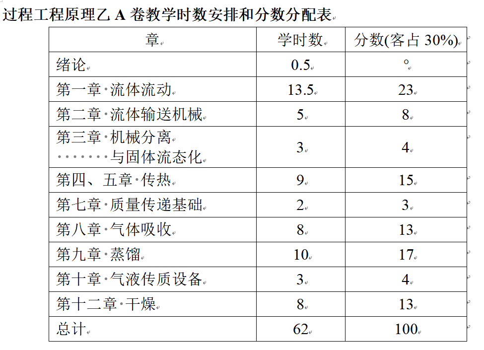

# 化工原理（乙）

??? note "资源文件"
    [点击跳转](https://pan.baidu.com/s/17au4S0Cl9OWcHyB2PmlB8A?pwd=qemz)

    通过网盘分享的文件：大三秋冬
    链接: https://pan.baidu.com/s/17au4S0Cl9OWcHyB2PmlB8A?pwd=qemz 提取码: qemz 
    --来自百度网盘超级会员v6的分享

## 课程内容

- 课程学分：4
- 任课教师：杨立峰、崔希利
- 课程时间：大三 秋冬
- 分数构成：平时40%+期末60%，平时分具体忘了，开学初说有工程作业，但是最后没有）
- 考试形式：闭卷考，无小测，无期中考
- 课程大纲：

??? note "教学安排"
	

## 个人经验

- 杨老师上大部分的内容，老师人很好，讲课还算可以吧，而且会讲评作业；崔老师上干燥这一章节，基本没听
- 这门课上课时间在周一/三的9,10节，每天都要6点才能吃饭太痛苦了，所以后面我基本都翘了（
- 这门课内容巨多，4学分也是合理的，主要分成流体、传热、传质（吸收、蒸馏、干燥），通常来说每一块小内容都能出一道大题，根据分数分布其实也能猜出来。
- 内容多，所以建议功夫花在平时，平时作业对考试参考价值较大，建议认真做，基本上对着PPT也能写出来（PPT也挺适合自学的），不会的就**求助舍友大佬**/GPT吧，AI偶尔犯错，大部分时候还是算对了的
- 平时课建议听吧，找网课/听智云都行；但是复习课一定要认真听，但是划的重点好像每年都有些出入，干燥考的内容感觉没有文件写的13分那么多，考的分数大概率和你花的时间成正比，内容真的很多，每一章都马虎不得，如果平时没有好好学的话，强烈建议期末好好复习，起码提前1周吧
- 考试内容跟上一届还是不太一样的，这次的客观题是填空题（部分选择）占比30分，考的比较细，但复习课基本涵盖了大部分内容，复习课PPT值得认真研究；大题70分，23级有一道简答题，考了4道计算题，流体管路计算、蒸馏塔板分析、传热交换每年都会考，实验也做过，难度不算大，但也不简单，主要靠理解~~和背公式~~吧，我考试的时候流体阻力计算失误了，修改花了大部分时间，差点没写完（
	- 大题建议死磕四次实验相关内容，原理弄懂之后应该大部分分数能拿到
	- 依旧不建议考前2-3天补天，~~但是替你们试过了一个晚上通关了~~
	- 复习列的提纲，仅供参考
## 课程资源

### 本人资料/笔记分享

- 复习提纲
- Z-lib下载的教材，但是第三版
- 老师的PPT
	- 平时发钉钉群里，顺手就下载了
	- 对着老师的PPT自学其实也挺轻松的

### 相关资源/经验帖

- 课程经验
	- 章节页的「[推荐阅读](./SAN_AW/#_4)」
	- （22级）[【学习天地】化工原理（乙）经验&资料验分享（含：考试大纲整理、个人笔记、教材pdf、PPT）（tag：化原；化原乙；化工原理乙） ](https://www.cc98.org/topic/6280009) ，笔记可以参考一下
- 回忆卷
	- （23级）[【学习天地】25-26秋冬 化工原理（乙）（过控专业课）回忆卷 ](https://www.cc98.org/topic/6405066)
	- （22级）[【学习天地】24-25春夏《化工原理（乙）》回忆卷/化原乙]( https://www.cc98.org/topic/6213092 )
