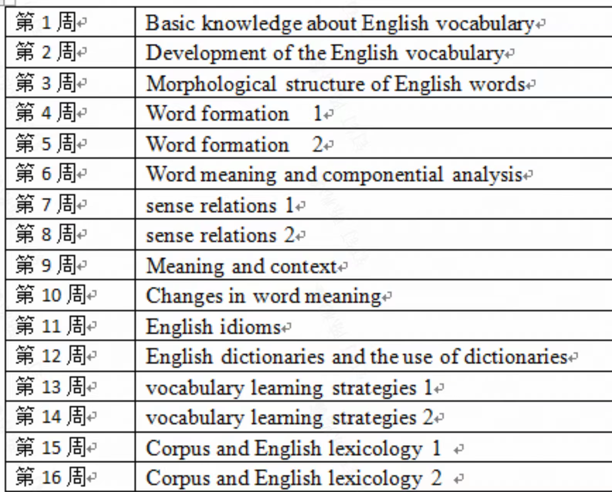

# 英语词汇学

## 课程内容

- 课程学分：1.5
- 任课教师：邵斌
- 课程时间：秋冬
- 分数构成：平时60%(出勤15，表现15，【3次】小测30)+期末论文40%
- 考试形式：无考试，无pre
- 课程大纲：见下图

## 个人经验

- 各种意义上的好课，不枉我跨校区上这门课，老师人很好，和蔼可亲，讲的内容也很好，但是没有考试可能比较难专注地听讲，PPT老师最后会分享到学在浙大，但不能下载，比较可惜，但上课认真听讲并记笔记的话，相信收获很多
- 老师上课的内容可能跟参考的教材有些出入，但整体上差不多，具体可以对比课程大纲和教材目录，好像老师自己也编写了一本教材，可能之后就能用上老师的新书了
- 老师喜欢和同学们互动，偶尔会有课程提问，基本上是按照名单顺序提问，每个人大概会被叫到2-3次，好像也会点1-2次名，但是这么好的老师，这么好的课，怎么忍心翘课！
- 有3次小测，在学在浙大上做，第2次会难一点，其他两次应该还好，难度不大，当然也有考试用AI做题的，老师管的不严，但建议诚信考试！小测题目可以参考98的帖子，放下面了
- 论文的话，现在AI这么发达，写起来应该不困难，最后两次课老师还会挨个指导论文写作，如果你的方向确定而且已经开始写了的话，方向不太确定的也可以跟老师讨论讨论，老师非常好！
- 顺带提一句，邵斌老师本科也是过控专业的，考研跨考了英语

## 课程资源

### 本人资料/笔记分享

- 小测资料（其实是老师发的）
- 论文+LaTex源码
	- 没有上传老师发了一份参考论文
	- 老师发的论文封面
	- 我自制的LaTeX论文模板（含我的论文内容，使用时删掉就行了）

### 相关资源/经验帖

- [【学习天地】2025秋冬英语词汇学【邵斌】小测题](https://www.cc98.org/topic/6369843 ) 
