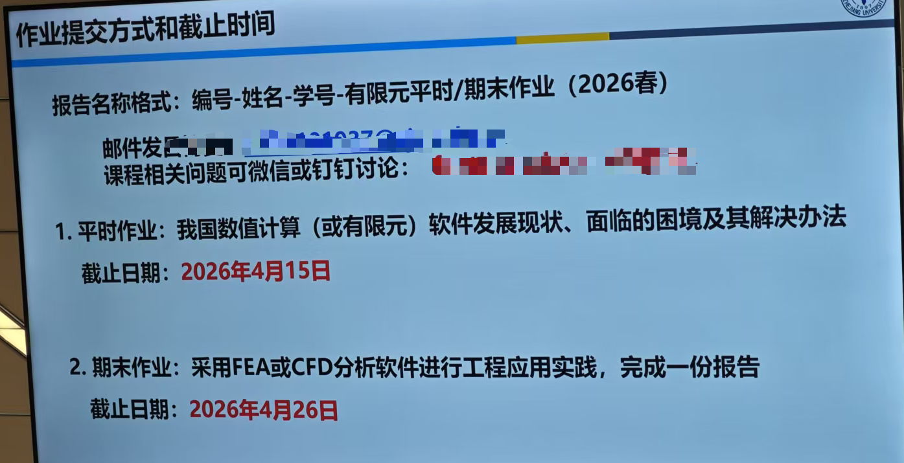

# 有限单元法及其工程应用

??? note "资源文件"
    [点击跳转](https://pan.baidu.com/s/1uJvCFk7w3qGdwVxcC8Llmw?pwd=4u4z)

    通过网盘分享的文件：大三春夏
    链接: https://pan.baidu.com/s/1uJvCFk7w3qGdwVxcC8Llmw?pwd=4u4z 提取码: 4u4z 
    --来自百度网盘超级会员v6的分享

## 课程内容

- 课程学分：2
- 任课教师：花争立/李克明/秦世杰
- 课程时间：大三 春
- 分数构成：忘了，有一次平时作业和一次期末大作业，没有小测，~~但是qsj喜欢做课堂作业~~
- 考试形式：无考试
- 课程大纲：和教材目录接近

## 个人经验

- 没有考试，所以基本没听，大家都在各忙各的，但如果研究方向是弹性力学相关，理论知识建议听一下，有个老师喜欢做课堂作业/提问，应该做了两次课堂作业吧，我有一次没去，不知道扣多少分，但最后也上4了，大作业才是大头吧
- 中间有几次演示Abaqus使用的，助教操作速度极快，生怕我学会，很多同学都上b站大学自学了，暂时没有推荐的网课，网上资源太少了，我更推荐跟着官方文档学习，自己实操一遍
- 有限元分析软件使用应该是最接近科研/就业的一门课，也是最实用的（没说课程内容），建议掌握软件的基本操作和使用，能理解掌握一些理论知识更好（等科研/就业需要了再学其实也不迟，现在学了也大概率忘了
- 关于二次编程，我上课时其实没咋听，但之前接触过一点Abaqus，结合AI大作业做起来还挺轻松的，但是平时作业和大作业格式有严格的模板规范，挺史的，提前接触一下期刊论文/毕设格式
- 分享一下我的作业，链接放下面了，作业要求如下

## 课程资源

### 本人资料/笔记分享

- 平时作业
- 大作业

### 相关资源/经验帖

无
